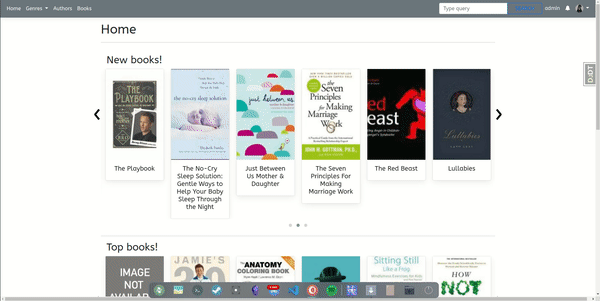
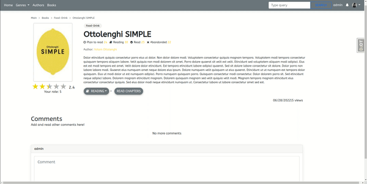
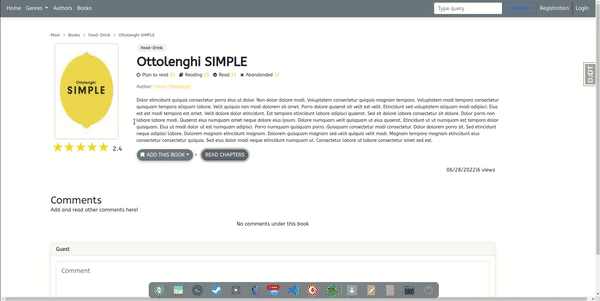
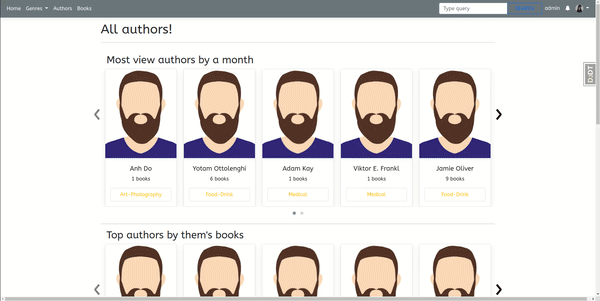
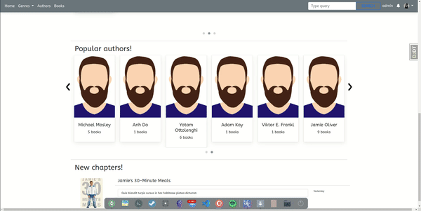

# Book-site

The studying website contains:
- Books
- Notifications
- Genres
- Authors
- Commenting
- Like, dislike comment
- Star rating
- Modal auth
- User profile

# How pages are looking:

## Home
## Home Page

## Book page

## Login and registration pages

## Authors pages

## Genres pages

For more settings configuration, open the "src" folder.
